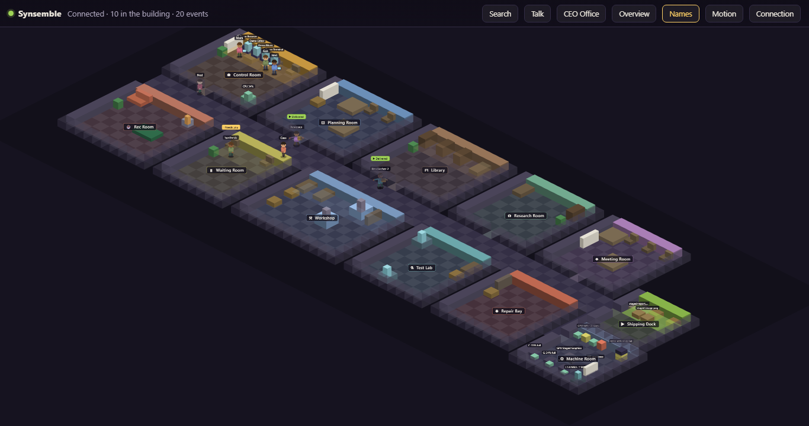
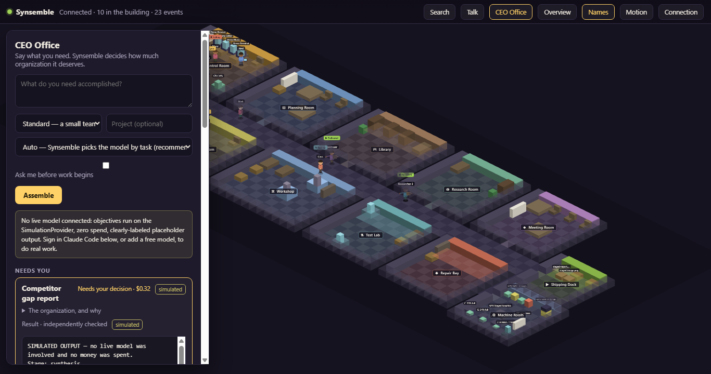
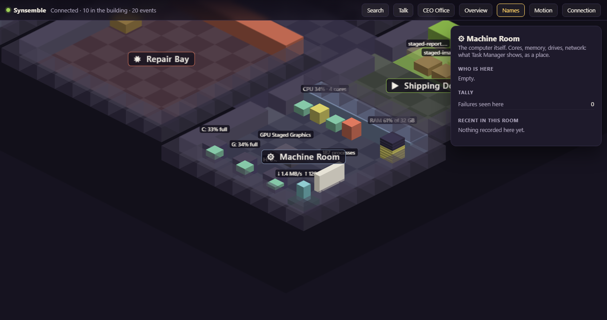

# Synsemble

### Intelligence, assembled around the work.

Synsemble is a Windows desktop app that runs a small AI organization you own. You say what you need. It decides how much organization the job deserves, hires the fewest workers that can do it, runs them, has the result checked by a worker that did not make it, and hands you the finished piece with the reasoning attached.

Then it shows you all of that as a building.

Every worker is a figure walking between rooms because of what it is actually doing. Your real Claude Code sessions walk the same halls. Nothing on screen moves for decoration.

## What Synsemble does

* Takes one objective and decides whether it deserves one worker or a small team
* Tells you who it hired and why, before the work starts
* Routes each job to the right lane: quick work to a cheap model, hard work to a strong one
* Uses Claude Code as the main provider, with no key and no setup beyond signing in
* Takes free and paid models from anywhere that speaks the common API, and switches to the next one when one runs out
* Has every result checked independently before it reaches you
* Keeps an append-only record of everything it did, in plain English
* Lets you accept, reject, or correct a result, and remembers the correction
* Watches your real Claude Code sessions through local hooks and shows them working
* Shows your computer itself as a room: processors, memory, drives, network, the apps you have open
* Works while you are away and reports what happened when you come back

## The three rules it lives by

**Movement means state.** No figure walks anywhere without a real reason. An idle animation is fine. A fake errand is not.

**Watching is free.** Observing Claude Code costs nothing and needs no key. Anything that would spend money or usage is opt-in, off by default, and says what it costs.

**Never lie about what it knows.** Every fact on screen is observed, or labelled inferred, or shown as unknown. Absent data reads as absent.

## Bring your own models

Synsemble never holds an Anthropic login. Claude Code signs in on its own, and Synsemble drives it the way a script would. Other models come in through their own keys, which are stored encrypted on your machine and never leave it.

Paid providers cannot spend a cent until you allow it on their card.

## Why I built it

I kept several AI chats open at once and could not see any of them. Windows behind windows, no sense of who was working, who was stuck, who was done.

I wanted to look at one place and know.

Then I wanted that place to be an organization I could actually run: give it a job, watch it staff the job honestly, and get back work that somebody checked.

That idea turned into Synsemble.

## Current status

Synsemble is under active development and testing.

What works today: the organization, the staffing, the verification, the record, the building, the machine room, Claude Code and outside models as workers, failover between models, the away report.

What is not finished: the dedicated workspace with projects and chat history, research workers that read the web, and measured track records for each model.

The core project is kept in a private repository while the software continues to be developed. This repository is the home for information, screenshots, development updates, and, later, trial builds.

**This repository does not contain the private Synsemble source code.**

## Trial

Not open yet.

When it opens, trial builds will be posted here as releases, and an installed copy will keep itself current automatically. Until then there is nothing to download.

## Part of The Grey Zone

Synsemble is one of a growing collection of software, games, writing, and experiments built inside **The Grey Zone**.

https://thegreyzone.xyz

---

**Built by Greygray with AI collaboration openly included in the process.**

Human judgment stays in the driver's seat.
