# Synsemble

### Intelligence, assembled around the work.

Synsemble is a Windows desktop app that runs a small AI organization you own. You say what you need. It decides how much organization the job deserves, hires the fewest workers that can do it, runs them, has the result checked by a worker that did not make it, and hands you the finished piece with the reasoning attached.

Then it shows you all of that as a building. And now the building is your whole computer.

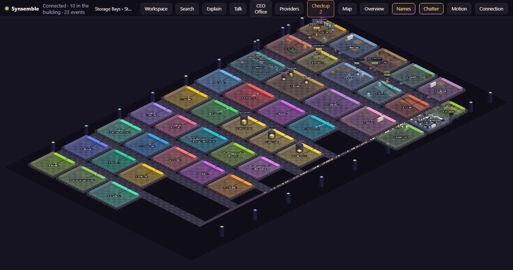

Forty-odd rooms and growing. Every worker is a figure walking between rooms because of what it is actually doing. Your real Claude Code sessions walk the same halls. Plug in a drive or a camera and a room appears for it. Nothing on screen moves for decoration, and nothing on screen is invented.

## The computer, as a place

The processor is a room. So is memory, the graphics chip, the network, cooling, power, every drive, every device on the USB tree, every AI provider you have connected, every project, every workflow. Energy runs through conduits between them, driven by the real load: disk reads light the disk line, a request leaving for a provider rides the request line, the whole floor breathes with the processor. Turn the computer on and the building is alive. Leave it alone and it goes quiet, honestly.

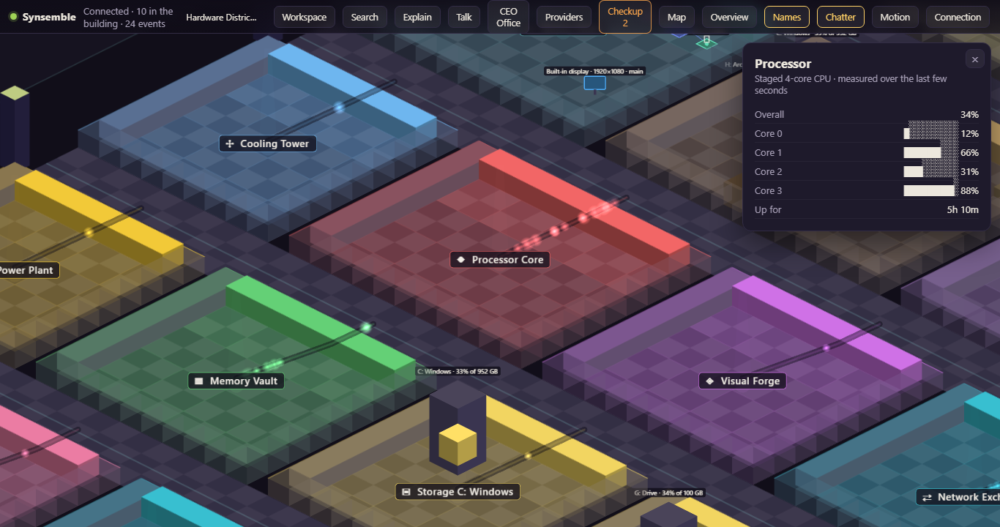

Click anything and it says what it is doing, in plain words, with the source of every number. Right-click anything and you get the things a person would actually want to do with it. Dangerous actions explain themselves and wait for you.

## The agents talk to each other

When they are working, they talk about the work: what it is, which provider is doing the thinking, whether it is going fine or whether it sucks, and whether a reviewer just sent it back. When they are not working, they talk about whatever. The facts in a line are real; the personality is theirs.

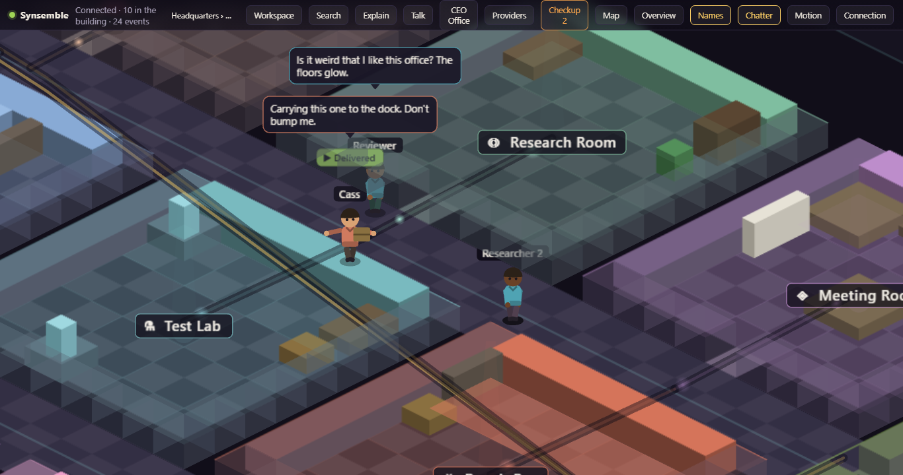

## What Synsemble does

* Takes one objective and decides whether it deserves one worker or a small team
* Tells you who it hired and why, before the work starts
* Routes each job to the right lane, with five routing modes from Free only to Best available, and budgets that hold paid calls back and say so
* Uses Claude Code as the main provider, with no key and no setup beyond signing in
* Takes free and paid models from anywhere that speaks the common API, and switches to the next one when one runs out, visibly
* Shows what every provider has been used for today, what it cost, what is resting and why, with the source of every number, and links to the real dashboards
* Has every result checked independently before it reaches you
* Keeps an append-only record of everything it did, in plain English
* Watches your real Claude Code sessions through local hooks and shows them working
* Shows your computer itself: hardware, drives, devices, running programs, and your files as a place you can work in safely
* Runs a checkup with evidence, likely cause, what it could lead to, what to do, and what it will never do on its own
* Has studios for writing, images, music, voice and video, each with its pipeline drawn and every human decision point marked
* Reads what you have left at every provider that publishes it, works out the burn rate, says how many days it lasts, and warns once rather than once a check
* Lets you type in a balance for a provider that publishes none, and labels it as yours
* Recommends automations from what keeps happening, and never builds one behind your back
* Works while you are away and reports what happened when you come back

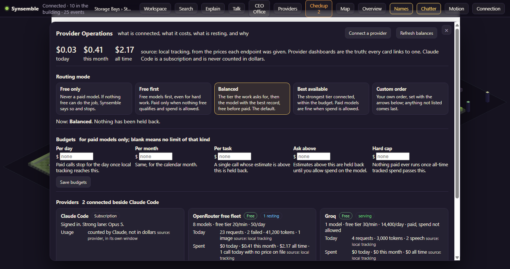

## What you have left, and how long it lasts

Where a provider publishes what is left, Synsemble reads it, works out the pace from the readings themselves, and says how many days that gives you. Where a provider publishes nothing, it says so on the card instead of leaving a blank, and you can type in what you have; that figure is labelled as yours and never as the provider's.

Every card has a **Test** button that asks the provider right now and reports exactly what came back: a real figure, a provider that publishes none, or a key that was refused. An empty card can always be explained.

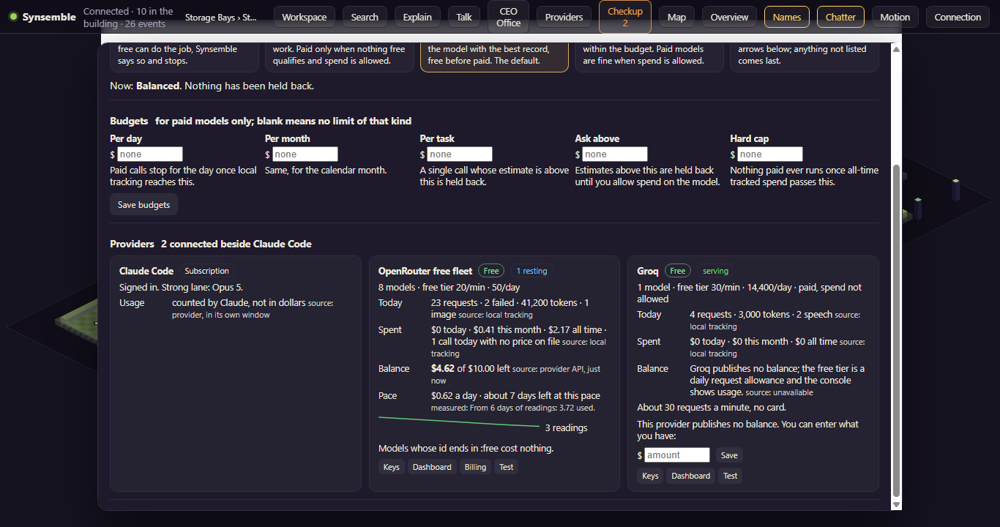

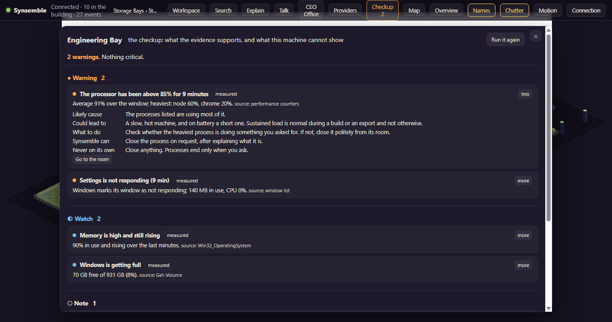

## The three rules it lives by

**Movement means state.** No figure walks anywhere without a real reason. An idle animation is fine. A fake errand is not.

**Watching is free.** Observing Claude Code costs nothing and needs no key. Anything that would spend money or usage is opt-in, off by default, and says what it costs.

**Never lie about what it knows.** Every fact on screen is observed, or labelled inferred, or shown as unknown. Absent data reads as absent. A temperature this laptop will not report shows as "not visible", not as "fine".

## Bring your own models

Synsemble never holds an Anthropic login. Claude Code signs in on its own, and Synsemble drives it the way a script would. Other models come in through their own keys, which are stored encrypted on your machine and never leave it. A setup wizard knows where every provider keeps its keys and what each gives away for free.

Paid providers cannot spend a cent until you allow it on their card.

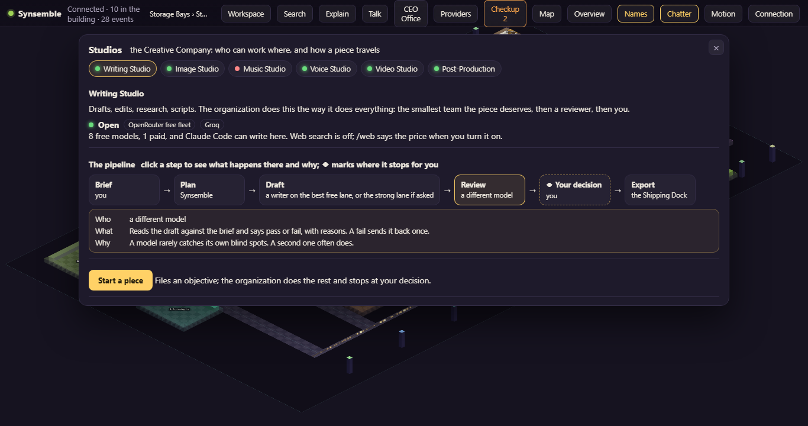

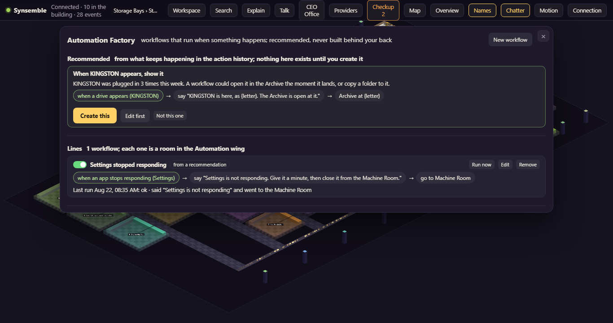

## Why I built it

I kept several AI chats open at once and could not see any of them. Windows behind windows, no sense of who was working, who was stuck, who was done.

I wanted to look at one place and know.

Then I wanted that place to be an organization I could actually run: give it a job, watch it staff the job honestly, and get back work that somebody checked.

Then I wanted the place to be the whole computer, so that nothing it does is hidden from me.

That idea turned into Synsemble.

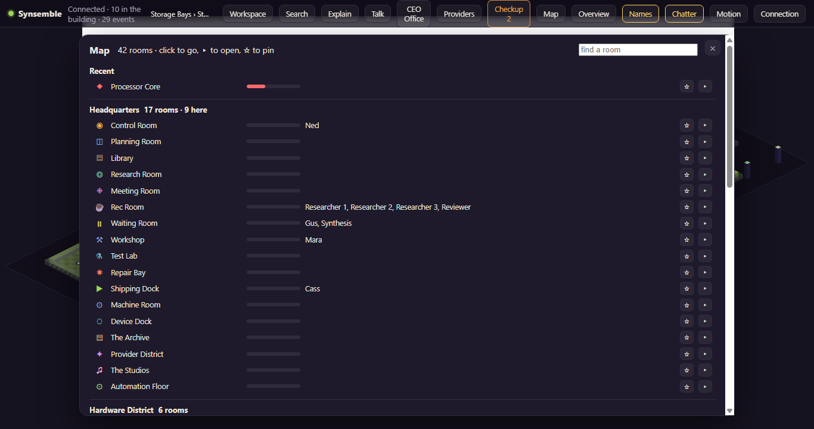

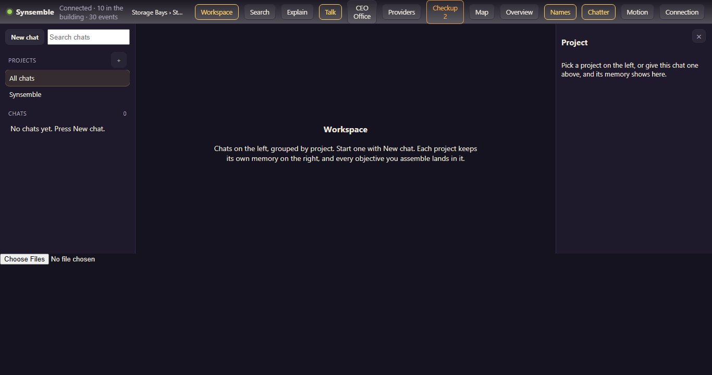

## Current status

Synsemble is under active development and testing.

What works today: the organization, the staffing, the verification, the record, the living building with its hardware district, storage bays, dock, provider district, studios, automation wing and engineering bay, the agents talking, Claude Code and outside models as workers, a fleet of free models with failover and a measured record for each, routing modes and budgets, provider operations with balances where a provider reports one, the workspace with projects, chats, project memory and skills, pictures and sound and video in and out, documents read as text, voice in and read-aloud, web search, the file archive with safe operations, the checkup, workflows with recommendations, the map, and the away report.

It is tested three ways. A unit suite runs the logic on its own and touches nothing real. A second suite starts the actual packaged application and drives it through the same interface the window uses: telemetry, devices, the safety refusals, the file archive, providers, workflows, a full objective, every panel, a restart, and the memory it uses while you hammer it. What that suite proves, it proves about the program you would install.

The third one uses the mouse. It opens every panel and presses every control with real pointer events, held as long as a finger holds them, then reports anything covered by something else, drawn off screen, too small to hit, unreadable against its background, or simply doing nothing when pressed. It exists because the bugs that reach a person are rarely the ones an API test can see: the first run found a close button that had been drawn in the wrong corner of the window, five buttons that could never have worked because the dialog behind them does not exist in this framework, and a search box that pointed the camera at a room without opening it.

What is not finished: search across a whole folder of documents, streaming for Claude Code replies, music generation (no provider is wired yet), and temperatures on machines whose firmware keeps them to itself.

The core project is kept in a private repository while the software continues to be developed. This repository is the home for information, screenshots, development updates, and, later, trial builds.

**This repository does not contain the private Synsemble source code.**

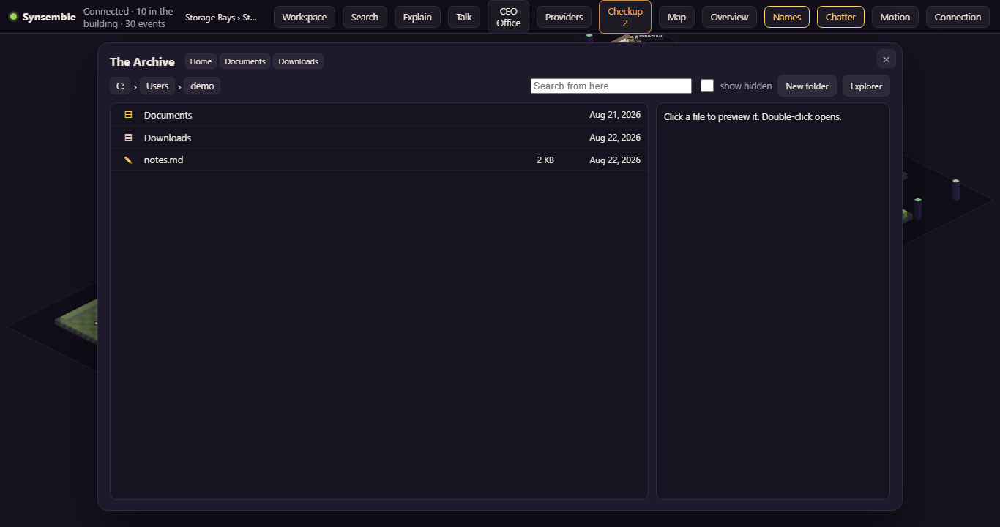

## What changed lately

Current build: **0.30.0** (2026-08-22). Every release is smoke-tested against the real packaged app before it is kept.

* **0.30.0** **the panel in Nick's photograph.** The inspector was not docked to the right-hand side at all: it sat at the top-left with 12px of itself off the edge of the window. A rule added in 0.11.0 to give .panel-x a positioning context set .panel { position: relative }, which overrode .panel's own position: absolute. With relative positioning, top: 58px; right: 12px stops meaning "docked to the top…
* **0.29.0** the bug hunt that clicks like a person (tools/ui-audit.cjs, npm run audit): it opens every panel and presses every control with real mouse events held at human speed, then reports COVERED, OFF-SCREEN, TINY, DEAD, UNREADABLE, CLIPPED and NOISY. Three real bugs on the first run. 1. **window.prompt does not exist in Electron; it throws.** New folder, Rename, New project, Rename project and Rename…
* **0.28.0** QuotaSpring folded in (src/shared/balances.ts + src/main/balances.ts): what is left at each provider, the burn rate, how long it lasts, low-balance alerts raised once, and a figure you can type in yourself labelled user-entered. QuotaSpring never worked, and the reason was not parsing: an ordinary OpenRouter key with no spend cap reports limit_remaining: null, so there was no figure and no…
* **0.27.0** the close x always works. Panels rebuilt their HTML eight times a second, so a real click held for ~120 ms lost its target between press and release and never fired: the x did nothing, at random. Rebuilds are now deferred while a pointer is held inside a panel. **And one copy at a time:** requestSingleInstanceLock, which is the actual root cause of the port dance, because two copies shared one…
* **0.26.0** end-to-end checks against the REAL packaged app (tools/e2e-app.cjs, 47 checks over CDP: telemetry, devices, Guardian refusals, the Archive, providers, automation, an objective, the renderer) plus a test mode (--test-data-dir, --test-hidden, --no-hooks) so a test run can never touch Claude Code's settings. It immediately found a real bug: updateThread accepted skillId and threw it away, so…
* **0.25.0** a worker on a project's objective stands in that project's room (renderer-side, from the objective's projectId); panels fit their content; the agents mention checkup findings and lines that ran.
## Trial

Not open yet.

When it opens, trial builds will be posted here as releases, and an installed copy will keep itself current automatically. Until then there is nothing to download.

## Part of The Grey Zone

Synsemble is one of a growing collection of software, games, writing, and experiments built inside **The Grey Zone**.

https://thegreyzone.xyz

---

**Built by Greygray with AI collaboration openly included in the process.**

Human judgment stays in the driver's seat.
